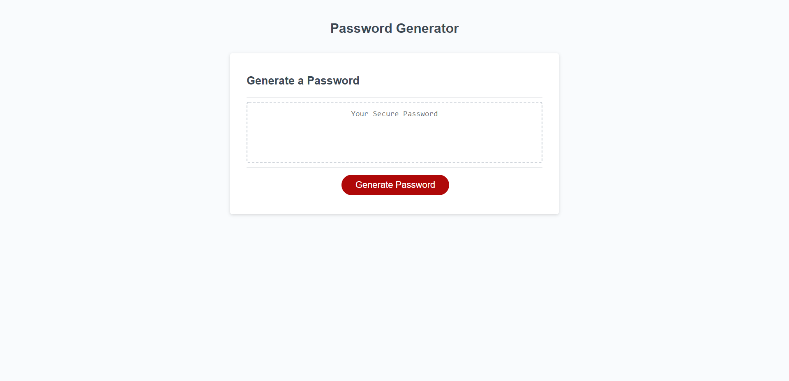

# module-3-challenge

### Description

* named variables so that each can be given function 
* added arrays in order to create the right lists for password characters, numbers, and alpha letters
* gave the generate button function to randomize the password
* created if statement for multiple options
* created certain criteria that allows for diverse answers on the password generator
* displayed finished product (password) on the screen when all prompts were answered

### Screenshot

### Link
